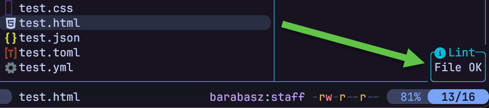
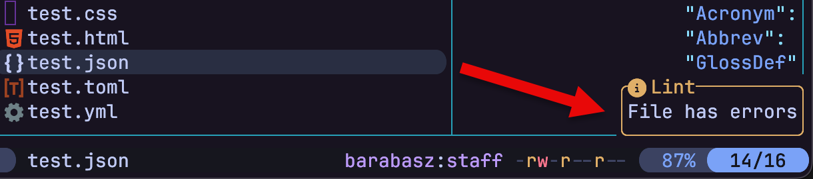

# lint.yazi

A highly customizable Yazi plugin to lint the hovered file and instantly show the result (OK / Errors) via `ya.notify`. It comes with sensible zero-config defaults for popular linters.





## Installation

Install the plugin using Yazi's package manager:

```bash
ya pkg add barabasz/yazi-plugins:lint
```

## Keybinding

Add the following configuration to your `~/.config/yazi/keymap.toml` (this example uses the `u` then `l` key combination):

```toml
[mgr]
prepend_keymap = [
    { on = [ "u", "l" ], run = "plugin lint", desc = "Lint hovered file", for = "unix" },
]
```

or:

```toml
[[mgr.prepend_keymap]]
on = [ "u", "l" ]
run = "plugin lint"
desc = "Lint hovered file"
for = "unix"
```

> [!IMPORTANT]
> Use any key you want, but make sure there are no conflicts with [default keybindings](https://github.com/sxyazi/yazi/blob/shipped/yazi-config/preset/keymap-default.toml).

Since Yazi prioritizes the first matching key, `prepend_keymap` takes precedence over defaults.

## Default Linters

By extension:

- `bash`, `sh` — shellcheck
- `c`, `cpp`, `h`, `hpp` — cppcheck
- `cjs`, `cts`, `js`, `jsx`, `mjs`, `mts`, `ts`, `tsx` — oxlint
- `css`, `htm`, `html` — biome
- `csv` — csvclean
- `json` — jq
- `lua` — luacheck
- `mk` — checkmake
- `py` — ruff
- `sql` — sqlfluff (T-SQL dialect)
- `toml` — taplo
- `xml` — xmllint
- `yaml`, `yml` — yamllint
- `zsh` — zsh (syntax check only, via `zsh -n`)

By file name — used as a fallback for dotfiles and extension-less files, which don't carry a meaningful extension for the lookup above to match:

- `Dockerfile` — hadolint
- `Makefile` — checkmake
- `.env` — dotenv-linter
- `.bash_login`, `.bash_logout`, `.bash_profile`, `.bashrc`, `.profile` — shellcheck
- `.zlogin`, `.zlogout`, `.zprofile`, `.zshenv`, `.zshrc` — zsh (syntax check only)

## Configuration

To override a default linter, add support for a new extension, or add support for a file matched by its full name instead — call the `setup` method in your `~/.config/yazi/init.lua`:

```lua
require("lint"):setup({
    linters = {
        -- Override default JS linter from oxlint to biome (also lints JS/TS)
        js = {
            cmd = "biome",
            args = function(p) return { "lint", p } end
        },
        -- Add support for PHP (built-in syntax check, no extra install needed)
        php = {
            cmd = "php",
            args = function(p) return { "-l", p } end
        }
    },
    filenames = {
        -- Add support for Vagrantfile (plain Ruby, no extension —
        -- matched by full file name instead of by extension)
        vagrantfile = {
            cmd = "ruby",
            args = function(p) return { "-c", p } end
        }
    }
})
```

`linters` entries are matched against the (lowercased) file extension. `filenames` entries are matched against the (lowercased) full file name, and are only consulted when there's no extension match — this is how dotfiles like `.zshrc` and extension-less files like `Dockerfile` get linted despite having nothing to match by extension. Both tables merge on top of the built-in defaults key by key, so you only need to specify what you want to add or change.
